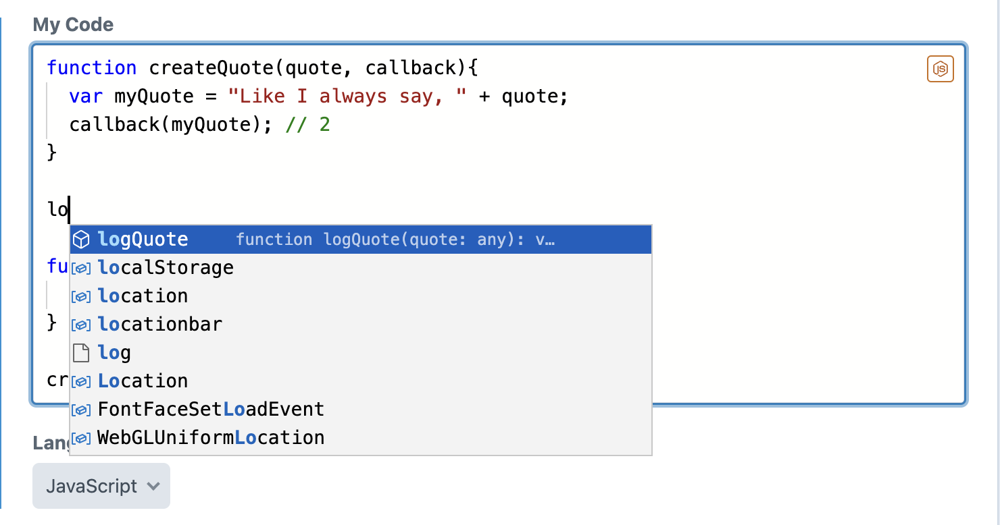
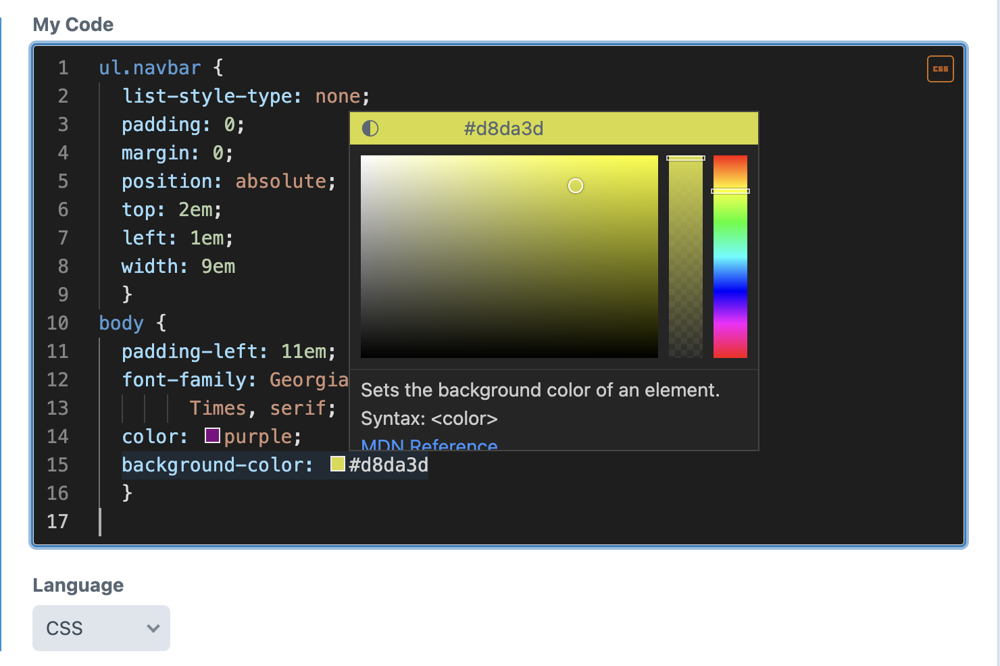
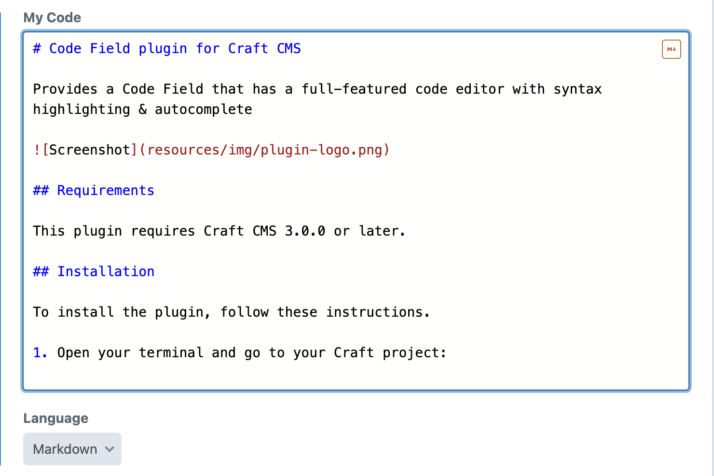
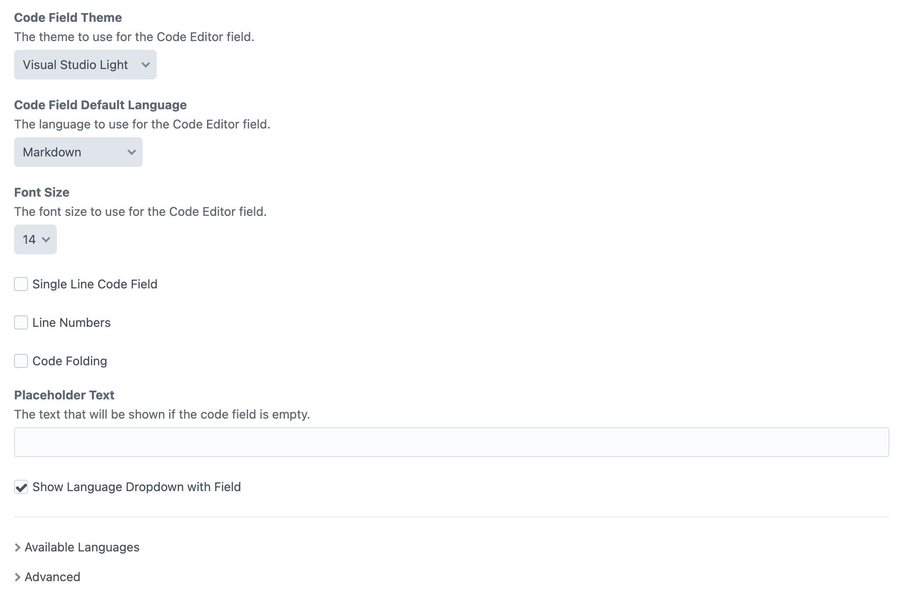
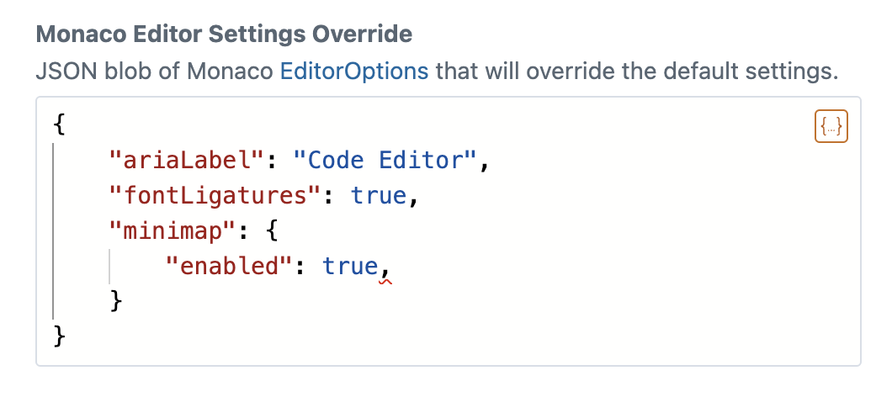
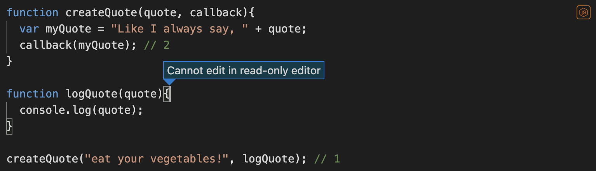

[](https://scrutinizer-ci.com/g/nystudio107/craft-code-field/?branch=develop-v3) [](https://scrutinizer-ci.com/g/nystudio107/craft-code-field/?branch=develop-v3) [](https://scrutinizer-ci.com/g/nystudio107/craft-code-field/build-status/develop-v3) [](https://scrutinizer-ci.com/code-intelligence)

# Code Field plugin for Craft CMS

Provides a Code Field that has a full-featured code editor with syntax highlighting & autocomplete

## Requirements

This plugin requires Craft CMS 3.0.0 or later or Craft CMS 4.0.0 or later.

## Installation

To install the plugin, follow these instructions.

1. Open your terminal and go to your Craft project:

        cd /path/to/project

2. Then tell Composer to load the plugin:

        composer require nystudio107/craft-code-field

3. In the Control Panel, go to Settings → Plugins and click the “Install” button for Code Field.

## Code Field Overview

Code Field is a Craft CMS field type that uses the [craft-code-editor](https://github.com/nystudio107/craft-code-editor) package to provide a modern code editor for content authors.

Code Field uses the [Monaco editor](https://microsoft.github.io/monaco-editor/) that leverages the same core code that the popular [VS Code](https://code.visualstudio.com/) editor uses.

That means it provides code highlighting, syntax checking, and autocompletion for over 80 languages.



It also has light, dark, and high contrast themes that can be chosen on a per-field basis.



It also sports as a variety of editor options such as font size, line numbers, code folding, and more.



## Configuring Code Field

Once the Code Editor plugin is installed, it provides a **Code** field type that you can create like any other Craft CMS field.

You can configure each field with its own discrete settings:



* **Code Field Theme** - The theme to use for the Code Field editor. It can be either Visual Studio Light, Visual Studio Dark, or High Contrast Dark.
* **Code Field Default Language** - The language to use for the Code Field editor. This can optionally be changed by content authors while using the field (see below)
* **Font Size** - The font size to use for the Code Field editor
* **Single Line Code Field** - Whether the editor should behave like a Craft field that can be tabbed between, and displays as a single line, with no line breaks.
* **Line Numbers** - Whether line numbers should be displayed in the Code Field editor.
* **Code Folding** - Whether code folding controls should be displayed in the Code Field editor margins.
* **Placeholder Text** - The text that will be shown if the Code Field is empty.
* **Show Language Dropdown with Field** - Whether content authors should have a Language dropdown menu available to them under the Code Field editor when editing an entry.

### Available Languages

Clicking on **Available Languages** discloses a list of over 80 languages:


Check the languages that you want to appear in the **Language** dropdown menu that is optionally displayed under the Code Field editor when editing an entry.

This lets you limit the languages available to content authors to a subset of all of the available languages.

### Advanced

Clicking on **Advanced** discloses a **Monaco Editor Settings Override** field:



This allows you to override any of the Monaco [EditorOptions](https://microsoft.github.io/monaco-editor/api/interfaces/monaco.editor.IEditorOptions.html) settings via a JSON blob configuration.

Using this, you can control every aspect of the Code Field editor.

## Using Code Field

Use the Code Field as you would any other Craft CMS field.

To output the contents of the field on the frontend, simply do:

```twig
{{ entry.someCode.value | raw }}
```

If you need to know the language or other settings for the Code Field editor, you can get that as well:

```twig
    {# Do whatever you need to do for this language #}
    
        <p>This is JavaScript!</p>
    
    {# Output the code #}
    <pre><code>{{ entry.someCode.value | raw }}</code></pre>
```

This will not result in any formatting of syntax highlighting of the code on the frontend; that's up to you to do as you see fit.

However, you can use the [craft-code-editor](https://github.com/nystudio107/craft-code-editor#in-frontend-templates) Twig macros directly to display the Code Field editor on the frontend.

In order to do this, you need to enable the `allowFrontendAccess` option in `craft-code-editor`.

The following `monacoOptions` allow you to make the field read-only (though the user can still interact with the code):
```json
{
    "domReadOnly": true,
    "readOnly": true
}
```



If you are storing Twig code, you can actually render that on the frontend using [renderObjectTemplate](https://craftcms.com/docs/4.x/dev/functions.html#renderobjecttemplate) if you like:

```twig
{{ renderObjectTemplate(entry.someCode.value, entry) }}
```

## Code Field Roadmap

Some things to do, and ideas for potential features:

* Add a default value for the field in Field Settings
* Provide support for additional third-party themes
* Add a setting to turn off the display of the language icon

Brought to you by [nystudio107](https://nystudio107.com)
